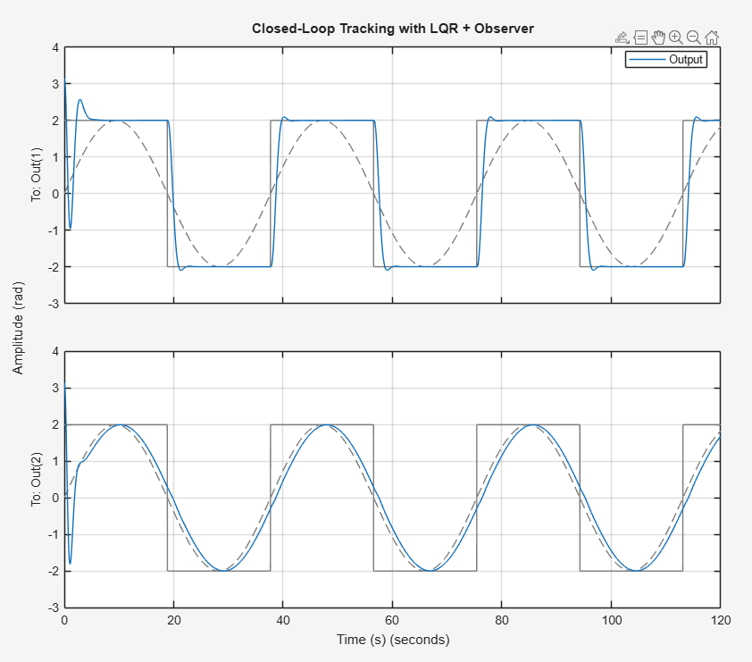
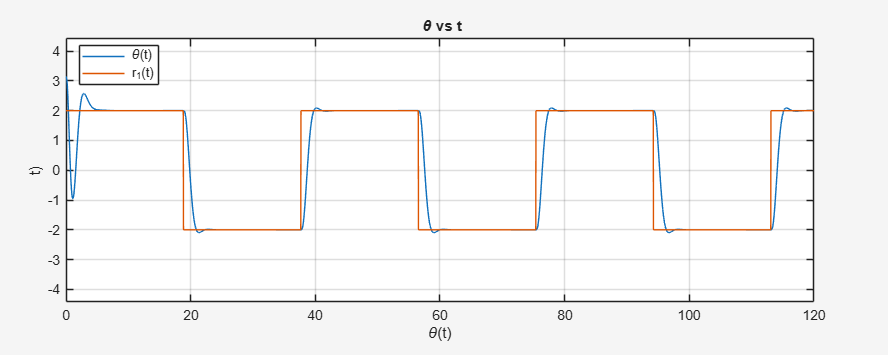
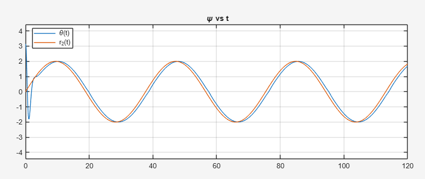
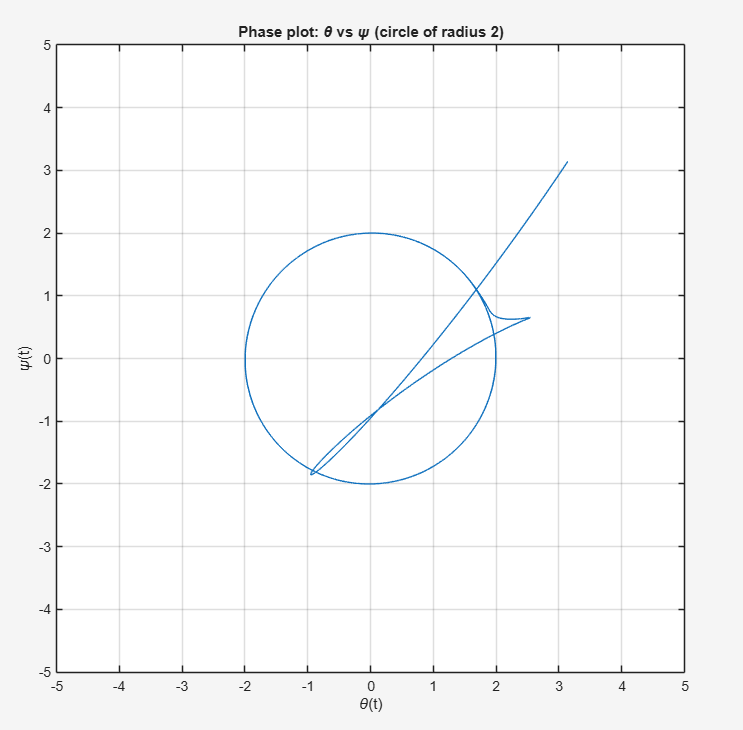

# LQR Tracking Control with Observer (MATLAB)

This project implements **optimal control and state estimation** for a multi-state dynamic system using:

- Linear Quadratic Regulator (LQR)
- Luenberger Observer
- Integral state augmentation for reference tracking

The controller enables the system outputs to track various reference trajectories including:

- Square wave signals
- Sinusoidal signals
- Circular trajectories
- Rotated elliptical trajectories

The simulations are implemented in **MATLAB** and demonstrate closed-loop tracking performance.

--

# System Model

The system is represented in state-space form:

The Quanser Aero 2 system models a **two degree of freedom helicopter** with:

- pitch angle $\theta$
- yaw angle $\psi$

The state vector is

$$
x =
\begin{bmatrix}
\theta \\
\psi \\
\dot{\theta} \\
\dot{\psi}
\end{bmatrix}
$$

The system is represented in state-space form:

$$
\dot{x} = Ax + Bu
$$

$$
y = Cx
$$

where

$$
A =
\begin{bmatrix}
0 & 0 & 1 & 0 \\
0 & 0 & 0 & 1 \\
-0.3208 & 0 & 0.0858 & 0 \\
0 & 0 & 0 & -0.0806
\end{bmatrix}
$$

$$
B =
\begin{bmatrix}
0 & 0 \\
0 & 0 \\
0.0232 & 0.0099 \\
-0.0224 & 0.0429
\end{bmatrix}
$$

$$
C =
\begin{bmatrix}
1 & 0 & 0 & 0 \\
0 & 1 & 0 & 0
\end{bmatrix}
$$

The outputs correspond to the **pitch and yaw angles**:

$$
y =
\begin{bmatrix}
\theta & \psi
\end{bmatrix}
$$

--

# Controller Design

To enable **reference tracking**, the system is augmented with two integral states:

$$
\dot{x}_5 = \theta - r_1
$$

$$
\dot{x}_6 = \psi - r_2
$$

The augmented state vector becomes

$$
x_a =
\begin{bmatrix}
x \\
x_5 \\
x_6
\end{bmatrix}
$$

The augmented system is

$$
\dot{x}_a =
\begin{bmatrix}
A & 0 \\
C & 0
\end{bmatrix}
x_a +
\begin{bmatrix}
B \\
0
\end{bmatrix}
u
$$

The optimal feedback gain is obtained using **LQR** by minimizing

$$
J = \int_0^\infty (x_a^T Q x_a + u^T R u) dt
$$

Weighting matrices used in the design:

$$
Q =
\begin{bmatrix}
300 & 0 & 0 & 0 & 0 & 0 \\
0 & 300 & 0 & 0 & 0 & 0 \\
0 & 0 & 30 & 0 & 0 & 0 \\
0 & 0 & 0 & 30 & 0 & 0 \\
0 & 0 & 0 & 0 & 2000 & 0 \\
0 & 0 & 0 & 0 & 0 & 2000
\end{bmatrix}
$$

$$
R =
\begin{bmatrix}
0.01 & 0 \\
0 & 0.01
\end{bmatrix}
$$

The resulting control law is

$$
u = -K\hat{x}_a
$$

# Observer Design

Since not all states are directly measured, a **Luenberger observer** is designed to estimate the system states.

Observer dynamics:

$$
\dot{\hat{x}} =
A\hat{x} + Bu + L(y - C\hat{x})
$$

where $L$ is the observer gain matrix.

The observer estimates the full augmented state which is then used in the feedback controller.

The final closed-loop system consists of:

- LQR state feedback  
- Luenberger state estimator  
- integral tracking states

# Reference Tracking Experiments

The controller is tested with multiple reference signals.

## Closed-Loop Tracking Performance

The LQR controller with observer achieves accurate tracking of both reference signals.

<p align="center">

</p>

Top plot:
- θ(t) tracking square-wave reference r₁(t)

Bottom plot:
- ψ(t) tracking sinusoidal reference r₂(t)

## Square Wave Tracking

The first experiment evaluates the system's ability to track a square-wave reference.

<p align="center">

</p>

The controller tracks the square-wave input with minimal steady-state error and fast transient response.

## Sinusoidal Tracking

The second experiment evaluates sinusoidal reference tracking.

<p align="center">

</p>

The ψ(t) output closely follows the sinusoidal reference signal with smooth dynamics.

## Circular Trajectory Tracking

To generate a circular trajectory of radius 2, the references are defined as

r₁(t) = 2 cos(ωt)  
r₂(t) = 2 sin(ωt)

<p align="center">

</p>

The phase trajectory θ vs ψ converges to a circle of radius 2 in steady state.

## Rotated Elliptical Trajectory

An ellipse with semi-axes

a = 2  
b = 1/3

is rotated by π/4 to generate a rotated reference trajectory.

The reference signals are obtained using a rotation matrix:

$$
r_1(t) = \cos(\phi)x(t) - \sin(\phi)y(t)
$$

$$
r_2(t) = \sin(\phi)x(t) + \cos(\phi)y(t)
$$

where

$$
x(t) = 2\cos(\omega t)
$$

$$
y(t) = \frac{1}{3}\sin(\omega t)
$$

<p align="center">

</p>

The phase trajectory $(\theta, \psi)$ converges to the desired rotated elliptical trajectory in steady state.

# Example Results

Tracking responses:

- θ(t) vs r₁(t)
- ψ(t) vs r₂(t)

Phase trajectories:

- Circular motion
- Rotated ellipse motion

--

# Repository Structure

```

project-root
│
├── Matlab            # MATLAB simulation scripts
│   ├── AAE564F14R1 (1).m
│   ├── AAE564F1.m
│   ├── AAE564F14R1.m
│   └── AAE564F23.m
│
├── figures           # Simulation plots and results
│   ├── aero2.png
│   ├── tracking_results.png
│   ├── theta_tracking.png
│   ├── psi_tracking.png
│   ├── circle_phase_plot.png
│   └── ellipse_phase_plot.png
│
├── report           # Project documentation           
│   └── Integral_Control_Design_for_Quanser_Aero_2.pdf
│
└── README.md         

```

# Key Concepts Demonstrated

This project demonstrates:

- Optimal control (LQR)
- Observer design
- State estimation
- Reference tracking
- Trajectory generation
- Closed-loop stability
- MATLAB simulation

--

# Tools Used

- MATLAB
- Control Systems Toolbox

--

# Author

Piyush More  
MS Aerospace Engineering  
Purdue University


