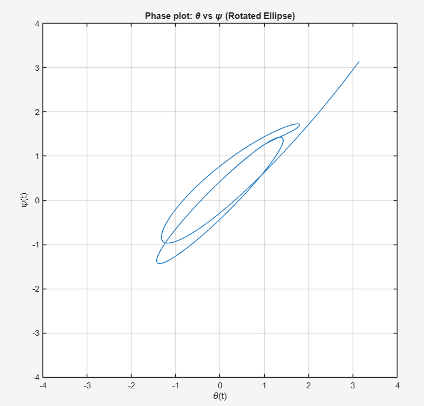

# LQR Tracking Control with Observer (MATLAB)

This project implements **optimal control and state estimation** for a multi-state dynamic system using:

- Linear Quadratic Regulator (LQR)
- Luenberger Observer
- Integral state augmentation for reference tracking

The controller enables the system outputs to track various reference trajectories including:

- Square wave signals
- Sinusoidal signals
- Circular trajectories
- Rotated elliptical trajectories

The simulations are implemented in **MATLAB** and demonstrate closed-loop tracking performance.

---

# System Model

The system is represented in state-space form:

\[
\dot{x} = Ax + Bu
\]

\[
y = Cx
\]

where

The system outputs correspond to:

---

# Controller Design

To enable **reference tracking**, the system is augmented with integral states:

The optimal feedback gain is obtained using **LQR**:

Weighting matrices:

The resulting control law is

**
---

# Observer Design

Since not all states are directly measured, a **Luenberger observer** is designed.
**

Observer dynamics:

The final closed-loop system is

---

# Reference Tracking Experiments

The controller is tested with multiple reference signals.

## Closed-Loop Tracking Performance

The LQR controller with observer achieves accurate tracking of both reference signals.

Top plot:
- θ(t) tracking square-wave reference r₁(t)

Bottom plot:
- ψ(t) tracking sinusoidal reference r₂(t)

## Square Wave Tracking

The first experiment evaluates the system's ability to track a square-wave reference.

The controller tracks the square-wave input with minimal steady-state error and fast transient response.

## Sinusoidal Tracking

The second experiment evaluates sinusoidal reference tracking.

The ψ(t) output closely follows the sinusoidal reference signal with smooth dynamics.

## Circular Trajectory Tracking

To generate a circular trajectory of radius 2, the references are defined as

r₁(t) = 2 cos(ωt)  
r₂(t) = 2 sin(ωt)

The phase trajectory θ vs ψ converges to a circle of radius 2 in steady state.

## Rotated Elliptical Trajectory

An ellipse with semi-axes

a = 2  
b = 1/3

is rotated by π/4 to generate a rotated reference trajectory.

The system output converges to the desired rotated elliptical trajectory.

# Example Results

Tracking responses:

- θ(t) vs r₁(t)
- ψ(t) vs r₂(t)

Phase trajectories:

- Circular motion
- Rotated ellipse motion

---

# Repository Structure

---

# Key Concepts Demonstrated

This project demonstrates:

- Optimal control (LQR)
- Observer design
- State estimation
- Reference tracking
- Trajectory generation
- Closed-loop stability
- MATLAB simulation

---

# Tools Used

- MATLAB
- Control Systems Toolbox

---

# Author

Piyush More  
MS Aerospace Engineering  
Purdue University

